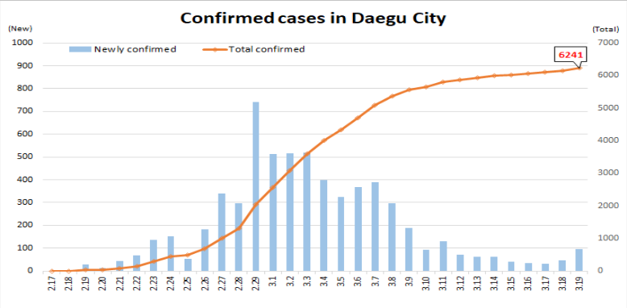
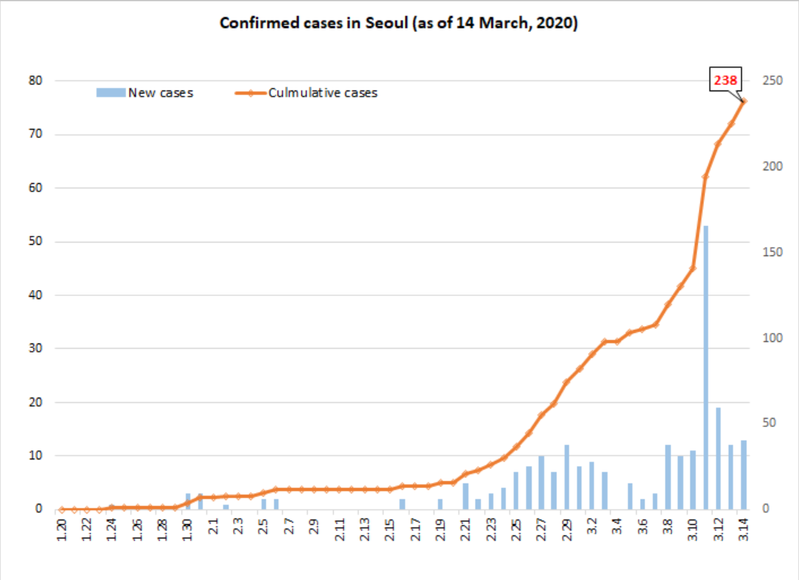

---
output:
  html_document:
    toc: true
    toc_depth: 5
    toc_float: true
---
```{r intro, echo=FALSE, results="hide"}
knitr::opts_chunk$set(echo=FALSE, 
                      message=FALSE, 
                      comment = "", 
                      warning=FALSE, 
                      results="hide") 
knitr::opts_knit$set(root.dir = "C:/Users/YoonJoung Choi/Dropbox/0 Project/COVID19_SouthKorea/")

date<-as.Date(Sys.time(	), format='%d%b%Y')
time<-Sys.time()

suppressMessages(library(dplyr))
suppressMessages(library(ggplot2))
suppressWarnings(suppressMessages(library(tidyverse)))
suppressWarnings(suppressMessages(library(readxl)))
suppressMessages(library(plotly))

```

__COVID-19 in South Korea - and potential implications for us (wherever we are)__ 

(Updated: `r time`)  

So, I have been watching the epidemic in China and Korea since the beginning, but it is still not easy to settle into this reality here in the US. 

First of all, everyone, __STAY HEALTHY and [see what YOU can do](https://www.cdc.gov/coronavirus/2019-ncov/protect/index.html)__! 

Second, there are many excellent articles, especially including [this one](https://www.washingtonpost.com/world/2020/03/13/how-countries-around-world-have-tried-contain-coronavirus/?arc404=true), but I'm sharing some more questions (see left panel) and data for those who are curious about the situation in Korea specifically. All data are from press release from [KCDC](https://www.cdc.go.kr/) - available to the public in both Korean and English. Kudos! 

By the way, to understand the Korean context, see below figure from [Washington Post](https://www.washingtonpost.com/world/asia_pacific/coronavirus-test-kits-south-korea-us/2020/03/13/007f14fc-64a1-11ea-8a8e-5c5336b32760_story.html).  

```{r plotworld, results="asis", fig.align="left", out.width = "600px"}
knitr::include_graphics("WP_casetrends.png")
```
(__Source__: Washington Post's [How countries arond the world have tried to contain the coronavirus](https://www.washingtonpost.com/world/asia_pacific/coronavirus-test-kits-south-korea-us/2020/03/13/007f14fc-64a1-11ea-8a8e-5c5336b32760_story.html))

#####__Q 1. When did it start?__ 

On January 20, 2020, there was the first laboratory confirmed COVID case. 

#####__Q 2. How fast has it been spreading?__ 
For this question, let's focus on __the number of new cases by day__. 
```{r dataByDay}
dta<-read_excel("C:/Users/YoonJoung Choi/Dropbox/0 Project/COVID19_SouthKorea/KCDC_data.xlsx", sheet = "ByDay")

    #table(dta$group)
    #table(dta$grouplabel)

dtanewcasebyday<-dta %>%
    select(Date_PressRelease, date, newconfirmedcases) %>%
    mutate(date=as.Date(date))

total<- dtanewcasebyday %>% 
    select(newconfirmedcases) %>% summarize_all(funs(sum))

currentdate<- dtanewcasebyday %>% 
    select(date) %>% summarize_all(funs(max))
    
```
For about a month, only 30 cases were confirmed - mostly in/near Seoul. However, _starting from the case No. 31 (a super transmitter who was confirmed on February 18)_, the number of new cases exponentially increased - primarily in Daegu and a region surrounding it but throughout the country. For 10 days, more than 400 new cases were confirmed everyday, with a peak of 909 new cases on February 29. About More recently, the number of new cases started to decrease (see below). __As of `r currentdate`, a total of `r total` people have been infected__. 

```{r plottrendkorea, results="asis", fig.align="left", out.width="600px"}
dta<-dtanewcasebyday

plot_ly(dta, x=dta$date, y=dta$newconfirmedcases, 
        type = 'bar' ) %>%
        layout(
            title = "Trends of new confirmed COVID-19 cases per day",
            xaxis = list(title = "Date",  
                         autotick = FALSE,
                         showticklabels = TRUE, 
                         tickfont = list(size=6), 
                         tickangle=-90),
            yaxis = list(title = "Number of new confirmed cases"))
```
(__Source__: KCDC's [daily press release](https://www.cdc.go.kr/board/board.es?mid=&bid=0030) on `r currentdate`)

In Daegu, where about three quarters of the cases are concentrated, the daily number of new cases has decreased clearly. Thank God! 
```{r plottrenddaegu, results="asis", fig.align="left", out.width = "600px"}

```
(__Source__: Figure from KCDC's [daily press release](https://www.cdc.go.kr/board/board.es?mid=&bid=0030), _"Updates on COVID-19 in Korea (as of 15 March)"_)

But, COVID can and does continue to spike up. In Seoul, there was a peak around the same time with the sharp epidemic in Daegu, followed by several days with much lower number of or no new cases. But, there seems to be a specific call-center related epidemic, as shown in the sudden increases in the number of new cases around March 11th.  

```{r plottrendseoul, results="asis", fig.align="left", out.width = "600px"}

```
(__Source__: Figure from KCDC's [daily press release](https://www.cdc.go.kr/board/board.es?mid=&bid=0030), _"Updates on COVID-19 in Korea (as of 14 March)"_)

#####__Q 3. What age groups are affected?__ 
```{r dataByAgeSex}
dta<-read_excel("C:/Users/YoonJoung Choi/Dropbox/0 Project/COVID19_SouthKorea/KCDC_data.xlsx", sheet = "ByAgeSex")

    #table(dta$group)
    #table(dta$grouplabel)

dtabyage<-dta %>%
    filter(group=="age") %>%
    select(Date_PressRelease, grouplabel, confirmedcases, deaths) %>%
    mutate(
        date=as.Date(Date_PressRelease, "%m/%d/%y"), 
        deaths=as.numeric(deaths), 
        deaths=ifelse(is.na(deaths)==T, 0, deaths),
        grouplabel=ifelse(grepl("bove", grouplabel) == T, "80-", grouplabel),
        age=sapply(strsplit(grouplabel,"-"), `[`, 1) , 
        agegroup=grouplabel, 
        agegroup=ifelse(grouplabel=="80-", "80+", agegroup)
        ) %>%
    select(-grouplabel)%>%
    arrange(Date_PressRelease, age)

    #table(dtabyage$age)

dtapop<-read.csv("C:/Users/YoonJoung Choi/Dropbox/0 Project/COVID19_SouthKorea/WPP2019_KoreaPop.csv")
dtapop<-dtapop %>%    
    filter(is.na(pop10)==F)  %>%
    mutate(
        age=as.character(Age)) %>%
    select(age, pop10)

dtabyage<-left_join(dtabyage, dtapop, by = "age") %>%
    mutate(
        incidence=round(100*confirmedcases/pop10),
        mortality=round(100*deaths/confirmedcases, 1),
        latest=date==max(date)
        ) 
    
latest<-max(dtabyage$date)
    
```

```{r}
dta<-dtabyage%>%filter(latest==TRUE & age==20)
incidence20<-max(dta$incidence)
```
For this question, let's look at the total cumulative number of confirmed cases since the outbreak _per 100,000 population_ by age group, not the absolute number. Also, keep in your mind, this is what we see _under a very aggressive track-test-isolate strategy_ (see [this](https://www.washingtonpost.com/world/asia_pacific/coronavirus-test-kits-south-korea-us/2020/03/13/007f14fc-64a1-11ea-8a8e-5c5336b32760_story.html) and [this](https://www.washingtonpost.com/world/2020/03/13/how-countries-around-world-have-tried-contain-coronavirus/?arc404=true)). Finally, KCDC releases the number by 10-year age group, and I'm following that categorization.  

* Incidence rate is substantially high in the 20s: `r incidence20` people have been infected per 100,000 population in their 20s. At least partially, this is reflection of a [very concentrated epidemic in Daegu related to a church](https://www.washingtonpost.com/world/asia_pacific/south-korea-orders-temporary-shutdown-of-messianic-church-linked-to-more-than-half-the-countrys-coronavirus-cases/2020/02/23/728278f0-5650-11ea-8efd-0f904bdd8057_story.html), and the age pattern among the church attendants. So this age pattern may not be relevant for more generalized pandemic situation.   
* Incidence rate among those under 20 is low. It may indicate either children are less susceptible, and/or - more importantly - they have been protected at home since all Korean schools have been in long winter break (typically over several weeks) or under temporary closure since the end of December, 2019.  

```{r plotincidence, results='asis', fig.align="left", out.width="600px"}
dta<-dtabyage%>%filter(latest==TRUE)
plot_ly(dta, x=dta$agegroup, y=dta$incidence, 
        mode = 'marker',
        transforms = list(
            list(
                type = 'groupby',
                groups = dta$date
                )
            )
        ) %>%
        layout(
            title = "Number of COVID-19 cases per 100,000 population, by age group",
            xaxis = list(title = "Age group"),
            yaxis = list(title = "Incidence rate per 100,000 population"))
```
(__Source__: KCDC's [daily press release](https://www.cdc.go.kr/board/board.es?mid=&bid=0030) on `r latest`, and UN [World Population Prospects 2019 Revision](https://population.un.org/wpp/))

#####__Q 4. What is mortality - overall and by age groups?__ 
```{r}
dta<-dtabyage%>%filter(latest==TRUE & age==80)
mortality80<-max(dta$mortality)
dta<-dtabyage%>%filter(latest==TRUE & age==70)
mortality70<-max(dta$mortality)

totaldeaths<- dtabyage %>% filter(latest==TRUE) %>% 
    select(deaths) %>% summarize_all(funs(sum))
mortalityrate<-round(totaldeaths*100 / total, 1)
```
Among those who have COVID, mortality rate among the elderly with COVID is very high: `r mortality80`% for those who are 80 or older, and `r mortality70`% for those who are between 70-79. 

Again, this is the case _under a very aggressive track-test-isolate strategy_, but with no nation wide lock down. As of `r latest`, a total of `r totaldeaths` people with COVID have died, `r mortalityrate`% among all COVID cases. These rates - overall as well as by age group - are lower than [mortality rates in China](https://www.who.int/docs/default-source/coronaviruse/who-china-joint-mission-on-covid-19-final-report.pdf). 

There are news articles about extremely over-burdened health systems especially in Daegu. I've read at least one mortality case on the newspaper while he/she was waiting for hospital admission, and patients from Daegu and a surrounding province being transferred to other less-affected provinces. However, my _impression_ (as a public health trained reader) is that most severe cases do receive treatment at hospitals. I'm looking for more systematic data on health systems' capacity and response.  
```{r plotmortality, results='asis', fig.align="left", out.width="600px"}
dta<-dtabyage%>%filter(latest==TRUE)
plot_ly(dta, x=dta$agegroup, y=dta$mortality, 
        mode = 'marker',
        transforms = list(
            list(
                type = 'groupby',
                groups = dta$date
                )
            )
        ) %>%
        layout(
            title = "Mortality rate (%) among confirmed COVID-19 cases, by age group",
            xaxis = list(title = "Age group"),
            yaxis = list(title = "Mortality per 100 COVID-19 cases"))
```
(__Source__: KCDC's [daily press release](https://www.cdc.go.kr/board/board.es?mid=&bid=0030) on `r latest`, and UN [World Population Prospects 2019 Revision](https://population.un.org/wpp/))

#####__Q 5. How extensive testing has been?__ 
```{r dataSummaryByDay}
dta<-read_excel("C:/Users/YoonJoung Choi/Dropbox/0 Project/COVID19_SouthKorea/KCDC_data.xlsx", sheet = "SummaryByDay")
    
names(dta)<- tolower(names(dta))   
dtabyday<-dta %>%
    filter(is.na(total)==F) %>%
    mutate(
        date=as.Date(date), 
        confirmed_discharged= ifelse(is.na(confirmed_discharged)==T, 0, confirmed_discharged),
        confirmed_deceased= ifelse(is.na(confirmed_deceased)==T, 0, confirmed_deceased),
        confirmed_isolated= ifelse(is.na(confirmed_isolated)==T, confirmed_total, confirmed_isolated),
        confirmed_total= ifelse(is.na(confirmed_total)==T, confirmed_discharged + confirmed_isolated + confirmed_deceased , confirmed_total),
        piu_total= ifelse(is.na(piu_total)==T, piu_beingtested+piu_testednegative, piu_total)
        ) %>%
    arrange(date) %>%
    mutate(
        test=lead(total)-total, 
        testpositive=lead(confirmed_total)-confirmed_total 
        )

totaltest<-round(max(dtabyday$total)/1000)
latestdatetest<-max(dtabyday$date)
totalpop<-round(sum(dtapop$pop10)/1000)
testrate<-round(max(dtabyday$total)/sum(dtapop$pop10))
```

Very aggressive. As of `r latestdatetest`, a total of `r totaltest` thousand people have been tested. There are `r totalpop` million people in the country, and __`r testrate` in every 1000 people__ have been test. This is the highest testing rate in the world. Epidemiological investigation of the case No. 3 (who was confirmed on February 18th) prompted immediate and massive testing in Daegu and nation wide.  

```{r plottest, results="asis", fig.align="left", out.width="800px"}
dta<-left_join(dtabyday, dtanewcasebyday, by = "date") 

plot_ly(dta, x=dta$date, y=dta$test, 
        type = 'bar', name='All tests' ) %>%
        add_trace(y=dta$newconfirmedcases, name = 'Positive tests') %>%
        layout(
            title = "Number of tests by day",
            xaxis = list(title = "Date",  
                         autotick = FALSE,
                         showticklabels = TRUE, 
                         tickfont = list(size=6), 
                         tickangle=-90,
                         range=c("2020-02-02","2020-03-15")
                         ),
            yaxis = list(title = "Number of tests"))
```
(__Source__: KCDC's [daily press release](https://www.cdc.go.kr/board/board.es?mid=&bid=0030). The number of tests is calculated based on the daily increase in the total number of tests reported.)

<p style="color:gray">
More questions and data coming soon, as I continue digging the awesome KCDC website...    
See [GitHub](https://github.com/yoonjoung/COVID19_SouthKorea) for data, code, and more information.  
For typos, errors, and questions: [contact me]("https://www.isquared.global/YJ")</p>

_Making Data Delicious, One Byte at a Time_, in good times and bad times.
