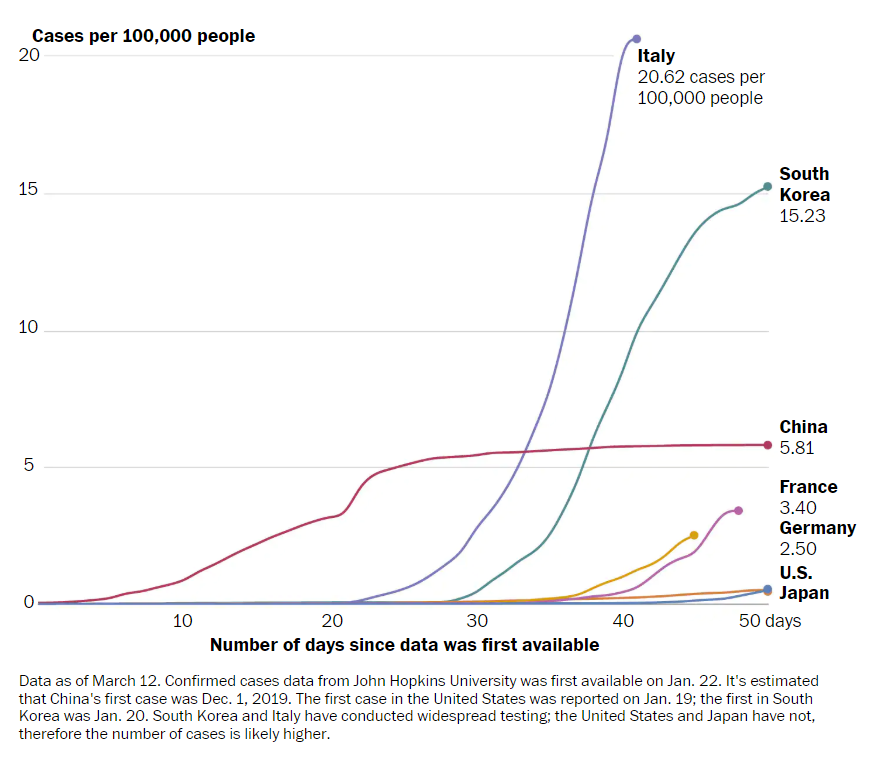
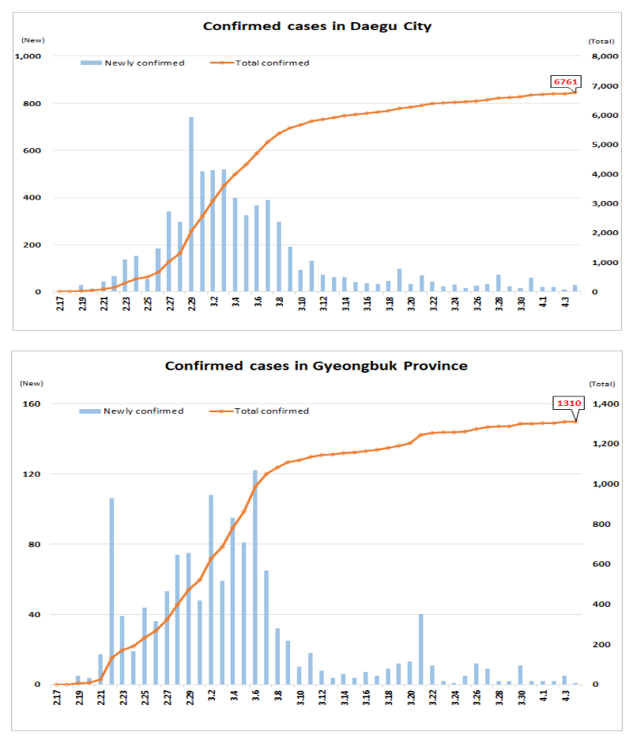

---
output:
  html_document:
    toc: true
    toc_depth: 5
    toc_float: true
---
```{r intro, echo=FALSE, results="hide"}
knitr::opts_chunk$set(echo=FALSE, 
                      message=FALSE, 
                      comment = "", 
                      warning=FALSE, 
                      results="hide") 
knitr::opts_knit$set(root.dir = "C:/Users/YoonJoung Choi/Dropbox/0 Project/COVID19_SouthKorea/")

date<-as.Date(Sys.time(	), format='%d%b%Y')
time<-Sys.time()

suppressMessages(library(dplyr))
suppressMessages(library(ggplot2))
suppressWarnings(suppressMessages(library(tidyverse)))
suppressWarnings(suppressMessages(library(readxl)))
suppressMessages(library(plotly))
suppressMessages(library(Matrix))

```

```{r dataByDay}
dta<-read_excel("C:/Users/YoonJoung Choi/Dropbox/0 Project/COVID19_SouthKorea/KCDC_data.xlsx", sheet = "ByDayNewCases")
str(dta)

    #table(dta$group)
    #table(dta$grouplabel)

dtanewcasebyday<-dta %>%
    filter(is.na(date)==F) %>%
    select(Date_PressRelease, date, newconfirmedcases) %>%
    mutate(date=as.Date(date))
```

```{r dataByAgeSex}
dta<-read_excel("C:/Users/YoonJoung Choi/Dropbox/0 Project/COVID19_SouthKorea/KCDC_data.xlsx", sheet = "ByAgeSex")

    #table(dta$group)
    #table(dta$grouplabel)

dtabyage<-dta %>%
    filter(group=="age") %>%
    select(Date_PressRelease, grouplabel, confirmedcases, deaths) %>%
    mutate(
        date=as.Date(Date_PressRelease, "%m/%d/%y"), 
        deaths=as.numeric(deaths), 
        deaths=ifelse(is.na(deaths)==T, 0, deaths),
        grouplabel=ifelse(grepl("bove", grouplabel) == T, "80-", grouplabel),
        age=sapply(strsplit(grouplabel,"-"), `[`, 1) , 
        agegroup=grouplabel, 
        agegroup=ifelse(grouplabel=="80-", "80+", agegroup)
        ) %>%
    select(-grouplabel)%>%
    arrange(Date_PressRelease, age)

    #table(dtabyage$age)

dtapop<-read_excel("C:/Users/YoonJoung Choi/Dropbox/0 Project/COVID19_SouthKorea/WPP2019_KoreaPop.xlsx", sheet="FiveYear")
dtapop<-dtapop %>%    
    filter(is.na(pop10)==F)  %>%
    mutate(
        age=as.character(Age)) %>%
    select(age, pop10)

dtabyage<-left_join(dtabyage, dtapop, by = "age") %>%
    mutate(
        incidence=round(100*confirmedcases/pop10),
        mortality=round(100*deaths/confirmedcases, 1),
        latest=date==max(date), 
        initial=date==min(date) 
        ) 
```

```{r dataSummaryByDay}
#data for all trend data: testing, incidnece, mortality 
dtapop<-read_excel("C:/Users/YoonJoung Choi/Dropbox/0 Project/COVID19_SouthKorea/WPP2019_KoreaPop.xlsx", sheet="FiveYear") %>%
    filter(is.na(pop10)==F)  
totalpop<-round(sum(dtapop$pop10)) #total population in thousand

dta<-read_excel("C:/Users/YoonJoung Choi/Dropbox/0 Project/COVID19_SouthKorea/KCDC_data.xlsx", sheet = "SummaryByDay")
    
names(dta)<- tolower(names(dta))   
str(dta)
dtabyday<-dta %>%
    filter(is.na(total)==F) %>%
    mutate(
        totalpop<-totalpop, 
        date=as.Date(date), 
        confirmed_discharged= ifelse(is.na(confirmed_discharged)==T, 0, confirmed_discharged),
        confirmed_deceased= ifelse(is.na(confirmed_deceased)==T, 0, confirmed_deceased),
        confirmed_isolated= ifelse(is.na(confirmed_isolated)==T, confirmed_total, confirmed_isolated),
        confirmed_total= ifelse(is.na(confirmed_total)==T, confirmed_discharged + confirmed_isolated + confirmed_deceased , confirmed_total),
        piu_total= ifelse(is.na(piu_total)==T, piu_beingtested+piu_testednegative, piu_total)
        ) %>%
    arrange(date) %>%
    mutate(
        test=lead(total)-total, #new tests in each day
        testpositive=lead(confirmed_total)-confirmed_total, #new positive in each day
        mortality=round(100*confirmed_deceased / confirmed_total, 1), #cumulative CFR (%)
        incidence=round(100*confirmed_total/totalpop, 1) #cumulative incidence per 100,000 population 
        )
```

```{r dataPediatricCases}
dta<-as.data.frame(read_excel("C:/Users/YoonJoung Choi/Dropbox/0 Project/COVID19_SouthKorea/KCDC_data.xlsx", sheet = "PediatricCases"))

names(dta) <- gsub(" ", "", names(dta))
names(dta)<- tolower(names(dta))   
str(dta)
table(dta$agegroup)

dtapediatric<-dta%>%
    filter(agegroup!="") %>%
    select(date_pressrelease, totalconfirmedcases, agegroup) %>%
    mutate(
        date=as.Date(date_pressrelease, "%m/%d/%y"), 
        age=sapply(strsplit(agegroup,"-"), `[`, 1)  
        ) %>%
    arrange(date, agegroup)
    #table(dtabyage$age)

dta<-read_excel("C:/Users/YoonJoung Choi/Dropbox/0 Project/COVID19_SouthKorea/WPP2019_KoreaPop.xlsx", sheet="SingleYear")
str(dta)

names(dta) <- gsub(" ", "", names(dta))
names(dta)<- tolower(names(dta))   
#str(dta)

dtapop<-dta %>%    
    filter(is.na(age)==F)  %>%
    filter(age<=18)  %>%
    mutate(
        pop=popmale_2020+popfemale_2020, 
        agegroup="0-18", 
            agegroup= ifelse(age>=0 & age<=2, "0-2", agegroup),        
            agegroup= ifelse(age>=3 & age<=6, "3-6", agegroup),        
            agegroup= ifelse(age>=7 & age<=12, "7-12", agegroup),        
            agegroup= ifelse(age>=13 & age<=15, "13-15", agegroup),        
            agegroup= ifelse(age>=16 & age<=18, "16-18", agegroup)   
        )%>%
    select(agegroup, pop) %>%
    group_by(agegroup) %>%
    summarize_all(funs(sum))

#str(dtapediatric)
#str(dtapop)

dtapediatric<-left_join(dtapediatric, dtapop, by = "agegroup") %>%
    mutate(
        incidence=round(100*totalconfirmedcases/pop, 1),
        #mortality=round(100*deaths/confirmedcases, 1),
        latest=date==max(date)
        ) 
```


```{r dataByRegion}
dtapop<-read_excel("C:/Users/YoonJoung Choi/Dropbox/0 Project/COVID19_SouthKorea/WPP2019_KoreaPop.xlsx", sheet="FiveYear") %>%
    filter(is.na(pop10)==F)  
totalpop<-round(sum(dtapop$pop10)) #total population in thousand

dtapopregion<-read_excel("C:/Users/YoonJoung Choi/Dropbox/0 Project/COVID19_SouthKorea/Citypopulation_SouthKorea.xlsx") 

dtapopregion$pop=dtapopregion[,10]
#table(dtapopregion$region)

dtapopregion<-dtapopregion %>%
    select(region, pop) %>%
    mutate(
        region=ifelse(region=="Seoul", "gg", region), 
        region=ifelse(region=="Incheon", "gg", region),  
        region=ifelse(region=="Gyeonggi-do", "gg", region),
        region=ifelse(region=="Gangwon-do", "gw", region),
        region=ifelse(region=="Chungcheongbuk-do", "cb", region),        
        region=ifelse(region=="Chungcheongnam-do", "cn", region),
        region=ifelse(region=="Daejeon", "cn", region),
        region=ifelse(region=="Sejong", "cn", region),
        region=ifelse(region=="Daegu", "gb", region),
        region=ifelse(region=="Ulsan", "gb", region),
        region=ifelse(region=="Gyeongsangbuk-do", "gb", region),
        region=ifelse(region=="Busan", "gn", region),
        region=ifelse(region=="Gyeongsangnam-do", "gn", region),
        region=ifelse(region=="Jeollabuk-do", "jb", region),
        region=ifelse(region=="Gwangju", "jn", region),
        region=ifelse(region=="Jeollanam-do", "jn", region),
        region=ifelse(region=="Jeju-do", "jj", region)
    ) %>%
    group_by(region) %>% summarize_all(funs(sum)) %>%
    mutate(
        total=sum(pop),
        pct=pop/total,#pop in 1000
        pop=totalpop*pct,#total pop from WPP 2019 revision
        total2=sum(pop)
        ) %>%
    select(region, pop) %>%arrange(region)
#head(dtapopregion, 10)

dta<-as.data.frame(read_excel("C:/Users/YoonJoung Choi/Dropbox/0 Project/COVID19_SouthKorea/KCDC_data.xlsx", sheet = "ByRegion"))

names(dta) <- gsub(" ", "", names(dta))
names(dta)<- tolower(names(dta))   

colnames(dta[,8:25])

###make sure the region/city columns are all numeric 
###replace missing with 0 in region/city columns 
for (i in 8:25){
    dta[,i]<-as.numeric(dta[,i])    
    for (j in 1:nrow(dta)){
        if (is.na(dta[j,i])==TRUE){
            dta[j,i]<-0    
        }
    }
}

dtabyregiondetail<-dta %>%
    mutate_each(funs(tolower), status) %>%
    filter(metric=="cumulative cases") %>%
    filter(status!="" & status!="shincheonji") %>%
    mutate(
        status=ifelse(status=="sub-total", "total", status),    
        status=ifelse(status=="subtotal", "total", status) 
    ) %>%
    arrange(date, status, time) %>%
    mutate(
        gg=seoul+ incheon+ gyeonggi, 
        gw=gangwon,
        cb=chungbuk,
        cn=daejeon+ sejong+ chungnam,   
        gb=daegu+ ulsan+ gyeongbuk,            
        gn=busan+ gyeongnam,            
        jb=jeonbuk,          
        jn=gwangju+ jeonnam,           
        jj=jeju,             
        airport=airportscreening, 
        TOTAL=gg+gw+cn+cb+gb+gn+jb+jn+jj+airport
    ) %>%
    select(date, time, status, gg,gw,cn,cb,gb,gn,jb,jn,jj,airport, 
           total, TOTAL)%>% 
    group_by(date)%>%
    mutate(
        tworeports =sd(time)!=0, 
        early =min(time)
        )%>%ungroup()%>%
    filter(tworeports==0 | (tworeports==1 & early==time))%>%
    select(-time, -tworeports, -early, -total)%>%
    arrange(date)

### TOTAL cumulative cases
dtabyregiontotal<-dtabyregiondetail %>% 
    filter(status=="total") %>% select(-status) %>% arrange(date)

dtabyregion<-dtabyregiontotal %>% 
    gather(region, cases, gg:airport, convert = FALSE) %>% 
    arrange(region, date) %>% 
    mutate(
        newcases=cases-lag(cases),
        newcases=ifelse(region!=lag(region), NA, newcases )
    )
    
dtabyregion<-left_join(dtabyregion, dtapopregion, by = "region") 

dtabyregion<-dtabyregion %>% 
    mutate(
        incidence =round(100000* cases/(pop*1000), 1), #per 100000 pop
        pctcases = round(100*cases/TOTAL, 1)#% region cases out of total
    )

### Deaths 
dtabyregiondeaths<-dtabyregiondetail %>% 
    filter(status=="deceased") %>% select(-status ) %>% arrange(date)%>%
    mutate(TOTALdeaths=TOTAL)%>% select(-TOTAL )

dtabyregiondeaths<-dtabyregiondeaths %>% 
    gather(region, deaths, gg:airport, convert = FALSE) %>% 
    arrange(region, date) 

dtabyregion<-left_join(dtabyregion, dtabyregiondeaths, by = c("region", "date")) 

dtabyregion<-dtabyregion %>% 
    mutate(
        cfr =round(100* deaths/cases, 1), #CFR %
        region=ifelse(region=="gg", "Gyeonggi", region),
        region=ifelse(region=="gw", "Gangwon", region),
        region=ifelse(region=="cb", "Chungbuk", region),
        region=ifelse(region=="cn", "Chungnam", region),
        region=ifelse(region=="jb", "Jeonbuk", region),
        region=ifelse(region=="jn", "Jeonnam", region),
        region=ifelse(region=="gb", "Gyungbuk", region),
        region=ifelse(region=="gn", "Gyungnam", region),
        region=ifelse(region=="jj", "Jeju", region),
        region=ifelse(region=="airport", "Airport", region)
    )%>%
    arrange(date, region)
```

#####__COVID-19 in South Korea - and potential implications for us (wherever we are)__ 

(Updated: `r time` EDT)  

So, I have been watching the epidemic in China and Korea since the beginning, but it is still not easy to settle into this reality here in the US. 

First of all, everyone, __STAY HEALTHY and [see what YOU can do](https://www.cdc.gov/coronavirus/2019-ncov/protect/index.html)__! 

Second, there are many excellent news articles and information sources, but I'm sharing some more __questions (see left panel) and answers for those who are curious about the situation in South Korea, specifically. Please note that the country has had a trace-test-isolate strategy consistently from the outset of this epidemic__. If you want to know more about South Korean situation - compared to other countries, see this Washington Post article: [How countries arond the world have tried to contain the coronavirus](https://www.washingtonpost.com/world/2020/03/13/how-countries-around-world-have-tried-contain-coronavirus/?arc404=true) 

All data are from press release from [KCDC](https://www.cdc.go.kr/) - available to the public in both Korean and English. Kudos! 

```{r plotworld, fig.align="left", out.width = "600px"}
#
```

---

#####__Q 9. How are different regions affected in the country?__
```{r}
incidenceGB<-dtabyregion%>%filter(date==max(date))%>%filter(region=="Gyungbuk")%>%select(incidence)%>%summarize_all(funs(mean))
incidenceGB<-round(incidenceGB, 0)

cfrGB<-dtabyregion%>%filter(date==max(date))%>%filter(region=="Gyungbuk")%>%select(cfr)%>%summarize_all(funs(mean))
```

This is one of common questions that I've received, as we see [huge variation in incidence rates across states and counties in the US](https://www.nytimes.com/interactive/2020/us/coronavirus-us-cases.html#states). 

In South Korea, however, __the entire country is under one same strategy for infectious diseases contol__, even though the country is [decentralized with nine provinces and eight cities](https://en.wikipedia.org/wiki/Administrative_divisions_of_South_Korea). So it's not surprising that __there is practically no regional differences in terms of the incidence or mortality rates, except Daegu city and Gyungbuk province (a province surrounding Daegu)__, which had [a massive outbreak related to a religious sect in late February](https://www.washingtonpost.com/world/asia_pacific/south-korea-orders-temporary-shutdown-of-messianic-church-linked-to-more-than-half-the-countrys-coronavirus-cases/2020/02/23/728278f0-5650-11ea-8efd-0f904bdd8057_story.html). About 80% of total confirmed cases have occurred in Daegu and Gyeungbuk province. 

* In Gyungbuk, including Daegu city, `r incidenceGB` people in 100,000 population have been infected - compared to below 6 per 100,000 population in all other regions.  

* In Gyungbuk, mortality has increased steadily and is currently `r cfrGB` % (i.e., `r cfrGB` people out of every 100 confirmed cases have died). Mortality is below 1% in three other provinces (and cities in the provinces), and no death has been reported in the remaining regions. 

It is notable that the outbreak in Daegu and Gyungbuk did not spread throughout the country more widely, although the country is relatively small - about the size of Kentucky or Indiana in the US. 

```{r plotbyregion, results="asis", fig.align="left", out.width="800px"}
dtafig<-dtabyregion%>%filter(date==max(date))

dtafig$region<-factor(dtafig$region, 
                    levels = unique(dtafig$region) 
                    [order(dtafig$incidence, decreasing = TRUE)])

figincidencerate<-plot_ly(dtafig, x=~region, y=~incidence, type = 'bar',
              name= "Province", marker = list(color = c('rgb(146,197,222)',  'rgb(146,197,222)', 'rgb(146,197,222)',"blue",  "red", 'rgb(146,197,222)','rgb(146,197,222)', 'rgb(146,197,222)', 'rgb(146,197,222)', 'rgb(146,197,222)')))%>% 
    layout(
            annotations = list(x = 0.2 , y = 0.95, 
                               text = "<b>COVID-19 incidence by region</b>", 
                               showarrow = F, xref='paper', yref='paper'),
            xaxis = list(title = "Date",  
                         autotick = FALSE,
                         showticklabels = TRUE, 
                         tickfont = list(size=10), 
                         tickangle=-90),
            yaxis = list(title = "Confirmed cases per 100,000 population") 
            
            )


dtafig<-dtabyregion%>%
    select(date, region, deaths, cases)%>% 
    filter(region!="Airport")%>%
    mutate(
        region3="Gyungbuk",
        region3=ifelse(region=="Gyeonggi", "Gyeonggi", region3),
        region3=ifelse(region!="Gyungbuk" & region!="Gyeonggi", "Gangwon & Gyungnam", region3)
    )%>%
    group_by(date, region3)%>%
    mutate(
        cases=sum(cases),
        deaths=sum(deaths)
    )%>%ungroup()%>%
    mutate(cfr=round(100*deaths/cases, 1))%>%
    arrange(date, region3, region)%>%
    filter(region3!=lag(region3))

figcfr<-plot_ly(dtafig, x=~date, y=~cfr, 
        type = 'scatter', mode = 'lines', color= ~region3 ,
        colors = c("dodgerblue3", "blue", "red")) %>%
        layout(
            annotations = list(x = 0.1 , y = 0.95, 
                               text = "<b>Trend of case fatality rates by province</b>", 
                               showarrow = F, xref='paper', yref='paper', xanchor = 'left'),
            xaxis = list(title = "Date",  
                         autotick = FALSE,
                         showticklabels = TRUE, 
                         tickfont = list(size=10), 
                         tickangle=-90),
            yaxis = list(title = "Deaths per 100 cases (%)"),
            legend = list(x = 0.55, y = 0.90)
            )

subplot(style(figincidencerate, showlegend = FALSE), 
        style(figcfr, 
              annotations= list(x = 0.55, y = 0.95, xanchor = 'left'), 
              legend = list(x = 0.55, y = 0.90)),
            nrows=1, shareY = FALSE, titleY = TRUE)

```
(Note: special cities are included in provinces where they are located. Daegu is included in Gyungbuk province. Seoul and Inchon are included in Gyeonggi province. Busan is included in Gyungnam province. Gangwon has a small number of confirmed cases and was combined with Gyungnam.)

```{r plotbyregionincidence, fig.align="left", out.width="800px"}

dtafig<-dtabyregion%>%filter(date==max(date))

dtafig$region<-factor(dtafig$region, 
                    levels = unique(dtafig$region) 
                    [order(dtafig$cases, decreasing = TRUE)])

fignewcases<-plot_ly(dtafig, x=~region, y=~cases, type = 'bar',
              marker = list(color = c('rgb(146,197,222)', 'rgb(146,197,222)', 'rgb(146,197,222)', 'rgb(146,197,222)', 'rgb(146,197,222)', 'rgb(244,165,130)', 'rgb(146,197,222)', 'rgb(146,197,222)', 'rgb(146,197,222)', 'rgb(146,197,222)')))%>% 
    layout(
            title = c("COVID-19 cases by region"),
            xaxis = list(title = "Date",  
                         autotick = FALSE,
                         showticklabels = TRUE, 
                         tickfont = list(size=10), 
                         tickangle=-90),
            yaxis = list(title = "Number of confirmed cases"), 
            legend = list(x = 1.2, y = 0.9, 
                          title=list(text='Provinces*'))
            )

dtafig<-dtabyregion%>%filter(date==max(date))

dtafig$region<-factor(dtafig$region, 
                    levels = unique(dtafig$region) 
                    [order(dtafig$incidence, decreasing = TRUE)])

figincidencerate<-plot_ly(dtafig, x=~region, y=~incidence, type = 'bar',
              marker = list(color = c('rgb(146,197,222)', 'rgb(146,197,222)', 'rgb(146,197,222)', 'rgb(146,197,222)', 'rgb(244,165,130)', 'rgb(146,197,222)', 'rgb(146,197,222)', 'rgb(146,197,222)', 'rgb(146,197,222)')))%>% 
    layout(
            title = c("COVID-19 incidence by region"),
            xaxis = list(title = "Date",  
                         autotick = FALSE,
                         showticklabels = TRUE, 
                         tickfont = list(size=10), 
                         tickangle=-90),
            yaxis = list(title = "Confirmed cases per 100,000 population"), 
            legend = list(x = 1.2, y = 0.9, 
                          title=list(text='Provinces*'))
            )

#

subplot(fignewcases, figincidencerate, nrows=1) %>%
        layout(  title ="Total number of cases and cumulative incidence rate by province", 
                 showlegend = FALSE )
```

```{r plotbyregionmortality, fig.align="left", out.width="800px"}
dtafig<-dtabyregion%>%
    select(date, region, deaths, cases)%>% 
    filter(region!="Airport")%>%
    mutate(
        region3="Gyungbuk",
        region3=ifelse(region=="Gyeonggi", "Gyeonggi", region3),
        region3=ifelse(region!="Gyungbuk" & region!="Gyeonggi", "Gangwon & Gyungnam", region3)
    )%>%
    group_by(date, region3)%>%
    mutate(
        cases=sum(cases),
        deaths=sum(deaths)
    )%>%ungroup()%>%
    mutate(cfr=round(100*deaths/cases, 1))%>%
    arrange(date, region3, region)%>%
    filter(region3!=lag(region3))

plot_ly(dtafig, x=~date, y=~cfr, 
        type = 'scatter', mode = 'lines', color= ~region3 ,
        colors = c("dodgerblue3", "blue", "red")) %>%
        layout(
            title = c("Trend of case fatality rates by province"),
            xaxis = list(title = "Date",  
                         autotick = FALSE,
                         showticklabels = TRUE, 
                         tickfont = list(size=10), 
                         tickangle=-90),
            yaxis = list(title = "Deaths per 100 cases (%)"),
            legend = list(x = 0.1, y = 0.7, 
                          title=list(text='Provinces*'))
            )
```

#####__Q 8. Is it spreading faster in some age groups than others?__ 
```{r}
temp<-dtabyage%>%select(date, agegroup, incidence)%>%filter(agegroup=="80+")%>%filter(date=="2020-03-03")
incidence80_0303<-mean(temp$incidence)

temp<-dtabyage%>%select(date, agegroup, incidence)%>%filter(agegroup=="80+")%>%filter(date=="2020-03-21")
incidence80_0321<-mean(temp$incidence)

temp<-dtabyage%>%select(date, agegroup, incidence, latest)%>%filter(agegroup=="80+")%>%filter(latest==TRUE)
incidence80_latest<-mean(temp$incidence)
 
```

So, we know about the age-pattern of mortality (i.e., higher in older ages, see Question 4) and relatively young patient population in South Korea (See Question 3). Meanwhile, as I saw overall mortality going up steadily (See Question 7.1), I wanted to know if COVID is spreading more rapidly among those who would have higher mortality risk (e.g., older people). One way to answer that question is to see if infection incidence rate (number of confirmed cases per population) has increased more rapidly in one age group than others. 

In all age groups, there was a rapid increase in early March, when the country had a huge and acute outbreak _(sorry, it's not very clear in the figure, because the age-specific trend data starts from March 3rd)_. Following that, however, __the infection rate has increased more rapidly among those who are 80 and older than in any other age groups (red line in the below figure)__: from `r incidence80_0303` per 100,000 people on March 3rd when detailed data by age were released first, to `r incidence80_0321` on March 21st, and __`r incidence80_latest` on `r date`__. The increase around mid-late March reflects [outbreaks in nursing homes](https://www.scmp.com/week-asia/health-environment/article/3075937/coronavirus-nursing-homes-emerge-south-koreas-new). But, __it is also notable that infection rate among the 20s has increased steadily since late March__ - which may be due to 'imported cases' among Koreans returning from overseas (this can be confirmed if age breakdown among those imported cases is available).  

_Hover over each figure to see values and more options._
```{r plotincidencetrendbyage, results="asis", fig.align="left", out.width="700px"}

dtasorted<-dtabyage %>%
    select(date, age, incidence) %>%
    mutate(
        age=paste0("incidence",age)
    ) %>%
    arrange(date, age)
#head(dtasorted, 15)

dta<-dtasorted %>% 
    spread(age, incidence, fill = NA, convert = FALSE) 
#head(dta, 20)
#str(dta)

fig <- plot_ly(dta, x=~date, y=~incidence0, name = "0-9", 
               type = 'scatter', mode='lines',
               line = list(color = c( "rgb(204,236,230)"))) %>% 
    add_trace(y = ~incidence10, name = "10-19", line = list(color = c( "rgb(153,216,201)"))) %>% 
    add_trace(y = ~incidence20, name = "20-29", line = list(color = c( "rgb(102,194,164)"))) %>% 
    add_trace(y = ~incidence30, name = "30-39", line = list(color = c( "rgb(65,174,118)"))) %>% 
    add_trace(y = ~incidence40, name = "40-49", line = list(color = c( "rgb(35,139,69)"))) %>% 
    add_trace(y = ~incidence50, name = "50-59", line = list(color = c( "rgb(0,109,44)"))) %>% 
    add_trace(y = ~incidence60, name = "60-69", line = list(color = c( "rgb(0,68,27)"))) %>% 
    add_trace(y = ~incidence70, name = "70-79", line = list(color = c( "rgb(33,113,18)"))) %>% 
    add_trace(y = ~incidence80, name = "80+", line = list(color = c( "rgb(239,59,44)"))) %>% 
    layout(
        title ="Trends of cumulative incidence rate by age group",
        yaxis = list(title = "Number of confirmed cases (per 100000 population)",
                     titlefont=list(size=12)), 
        legend = list(font=list(size=10)) 
        ) 

fig
```
(__Source__: KCDC's [daily press release](https://www.cdc.go.kr/board/board.es?mid=&bid=0030), and UN [World Population Prospects 2019 Revision](https://population.un.org/wpp/))   
_Note_: Age-specific data were first released on March, 3rd, and it has been updated daily since March 11th. 

```{r plotagecomposition, fig.align="left", out.width="800px"}
#Another approach, potentially simpler, is to see any changes in age-composition of confirmed cases. As expected based on the above figure, there are relatively more elderlies. 

#_Hover over each figure to see values and more options._

temp <- dtabyage%>%select(date, confirmedcases)%>%
    group_by(date)%>%summarize_all(funs(sum))%>%
    mutate(total=confirmedcases)%>%select(date, total)

dta<-left_join(dtabyage, temp, by = "date") %>% 
    select(date, agegroup, confirmedcases, total) %>% 
    mutate(
        pct=round(100*confirmedcases/total,1)    
    )


fig<-dta %>% group_by(agegroup) %>% 
    arrange(date) %>%
    plot_ly( x = ~date, y = ~pct, 
             color= ~agegroup, colors = 'Reds',
             type = "bar") %>%
    layout(
        title ="Age pattern of confirmed cases over time",
        yaxis = list(title = "Percent of confirmed cases",
                     titlefont=list(size=12)), 
        legend = list(font=list(size=10)),
        barmode = 'stack'
        ) 

fig
#(__Source__: KCDC's [daily press release](https://www.cdc.go.kr/board/board.es?mid=&bid=0030))   
#_Note_: Age-specific data were first released on March, 3rd, and it has been updated daily since March 11th. 
```

#####__Q 7.1. How has mortality changed over time?__ 

```{r}
latestbyage<-max(dtabyage$date)
totaldeaths<-dtabyage %>% filter(latest==TRUE) %>% 
    select(deaths) %>% summarize_all(funs(sum))
totalcases<- dtanewcasebyday %>% 
    select(newconfirmedcases) %>% summarize_all(funs(sum))
mortalityrate<-round(totaldeaths*100 / totalcases, 1)

date<-as.Date(Sys.time(	), format='%d%b%Y')
length<-as.Date(date, format="%Y-%m-%d") - as.Date("2020-1-20", format="%Y-%m-%d")
#It has been `r length`, since the first case was confirmed in South Korea. 
```

South Korea had the first COVID death on February 19th. As of `r latestbyage`, there have been a total of `r totaldeaths`, with an overall mortality rate of `r mortalityrate`% among all cases. 

The below graph shows trend of the overall mortality rate (starting from February 21st). The mortality rate (orange bars) initially increased for several days, but, as the number of new cases increased exponentially (see gray bars also Question 2), the mortality rate declined after the first peak. Then, it has increased gradually to the current level. Since South Korea still has been able to continue the trace-test-isolate strategy, it will be important to monitor mortality trends, providing important insight about this epidemic.  

```{r,  fig.align="left", out.width="600px"}
#{r plotcfrtrend, results='asis', fig.align="left", out.width="600px"}
dta<-dtabyday%>%filter(mortality>0)%>%select(date, mortality)

plot_ly(dta, x=dta$date, y=dta$mortality, 
        type = 'bar') %>%
        layout(
            title = "Trends of mortality among confirmed COVID-19 cases",
            xaxis = list(title = "Date",  
                         autotick = FALSE,
                         showticklabels = TRUE, 
                         tickfont = list(size=6), 
                         tickangle=-90),
            yaxis = list(title = "Mortality per 100 COVID-19 cases (all age groups)")
            )
```

_Hover over each figure to see values and more options._
```{r plotincidencetrend, results="asis", fig.align="left", out.width="800px"}
dta<-dtabyday%>%select(date, mortality, incidence)
#dta<-dtabyday%>%filter(mortality>0)%>%select(date, mortality, incidence)
dta$incidence<-dta$incidence/10

plot_ly(dta, x=dta$date, y=dta$incidence, 
        type = 'bar', name="Incidence rate (per million population)",
        marker = list(color = "rgb(204,204,204)")) %>%
        add_trace(y = ~mortality, name = "Case fatality rate (per 100 cases)" ,
                  marker = list(color = "rgb(253,141,60)")) %>%
        layout(
            title = "Trends of cumulative incidence and mortality by day",
            yaxis = list(title=""),  
            xaxis = list(  
                         autotick = FALSE,
                         showticklabels = TRUE, 
                         tickfont = list(size=6), 
                         tickangle=-90),
            legend = list(orientation = 'v',x = 0.1, y = 0.9) 
            )
```
(__Source__: KCDC's [daily press release](https://www.cdc.go.kr/board/board.es?mid=&bid=0030), and UN [World Population Prospects 2019 Revision](https://population.un.org/wpp/))

#####__Q 7.2. How has mortality changed over time, by age group?__ 

```{r}
latestbyage<-max(dtabyage$date)
mortality80<-dtabyage%>%filter(latest==TRUE & age==80)%>%
    select(mortality)%>%summarize_all(funs(mean))

initialbyage<-min(dtabyage$date)
mortality80initial<-dtabyage%>%filter(initial==TRUE & age==80)%>%
    select(mortality)%>%summarize_all(funs(mean))

```

The graph below shows trends of mortality by age group - starting from March 3rd. Mortality among those 80 and above has increased continuously. __As of `r latestbyage`, `r mortality80`% of people in their 80s who have confirmed COVID have died, increaed from `r mortality80initial`% on `r initialbyage`__. This increase is not surprising, considering the typical clinical timeline and prognosis of COVID infection. A more important question is _if and when_ the mortality rate will level off, as this epidemic progresses and a bigger proportion of population is affected.  

Mortality rate among the 70s has also increased but at a slower margin. Mortality among those in their 50s and 60s have remained similar over time or increased slowly.  

_Hover over each figure to see values and more options._
```{r plotmortalitytrendbyage, results="asis", fig.align="left", out.width="800px"}

temp<-dtabyage%>%filter(latest==TRUE & age==80)%>%select(mortality)%>%summarize_all(funs(mean))
upperrange<-round(temp$mortality+1)

dta50<-dtabyage%>%select(date, agegroup, mortality)%>%filter(agegroup=="50-59")
dta60<-dtabyage%>%select(date, agegroup, mortality)%>%filter(agegroup=="60-69")
dta70<-dtabyage%>%select(date, agegroup, mortality)%>%filter(agegroup=="70-79")
dta80<-dtabyage%>%select(date, agegroup, mortality)%>%filter(agegroup=="80+")

xaxislist<-list(title = "Date",  
                             autotick = FALSE,
                             showticklabels = TRUE, 
                             tickfont = list(size=8), 
                             tickangle=-90
                             )
yaxislist<-list(range=c(0.2, upperrange))

fig50<-plot_ly(dta50, x=~date, y=~mortality, 
               type = 'scatter', mode = 'lines', name = "50-59")%>%
       layout(xaxis = xaxislist,
              yaxis = yaxislist)
fig60<-plot_ly(dta60, x=~date, y=~mortality, 
               type = 'scatter', mode = 'lines', name = "60-69")%>%
       layout(xaxis = xaxislist,
              yaxis = yaxislist)
fig70<-plot_ly(dta70, x=~date, y=~mortality, 
               type = 'scatter', mode = 'lines', name = "70-79")%>%
       layout(xaxis = xaxislist,
              yaxis = yaxislist)
fig80<-plot_ly(dta80, x=~date, y=~mortality, 
               type = 'scatter', mode = 'lines', name = "80+") %>%
       layout(xaxis = xaxislist,
              yaxis = yaxislist)

subplot(fig50, fig60, fig70, fig80, shareY = TRUE) %>%
        layout(
            title ="Trends of cumulative mortality by age group",
            yaxis = list(title = "Morality (per 100 confirmed cases)",
                         titlefont=list(size=10)),
            legend=list(orientation = "h", x = 0.2, y=0.8)
            )

fig<-subplot(style(fig50, legend = list(x = 0.15, y = 0.90)),
        style(fig60, legend = list(x = 0.15, y = 0.90)),
        style(fig70, legend = list(x = 0.55, y = 0.90)),
        style(fig80, legend = list(x = 0.15, y = 0.90)) 
        )%>%
        layout(
            title ="Trends of cumulative mortality by age group",
            yaxis = list(title = "Morality (per 100 confirmed cases)",
                         titlefont=list(size=10))
            )

```
(__Source__: KCDC's [daily press release](https://www.cdc.go.kr/board/board.es?mid=&bid=0030), and UN [World Population Prospects 2019 Revision](https://population.un.org/wpp/))   
_Note_: Age-specific mortality data were first released on March, 3rd, and it has been updated daily since March 11th. 

#####__Q 6. How is it affecting children?__ 

```{r}
latestbyage<-dtabyage%>%filter(latest==TRUE)%>%
    select(date)%>%summarize_all(funs(max))

incidence09<-dtabyage%>%filter(latest==TRUE & agegroup=="0-9")%>%
    select(incidence)%>%summarize_all(funs(max))

incidence1019<-dtabyage%>%filter(latest==TRUE & agegroup=="10-19")%>%
    select(incidence)%>%summarize_all(funs(max))

deaths019<-dtabyage%>%filter(latest==TRUE & age<20)%>%
    select(deaths)%>%summarize_all(funs(sum))

latestpediatric<-dtapediatric%>%filter(latest==TRUE)%>%
    select(date)%>%summarize_all(funs(mean))
```

Compared to other age groups, incidence rates are much lower among those under 20 (See Question 3). There have been `r deaths019` deaths reported in these age groups, and mortality rates are also the lowest among all age groups (See Question 4). 

Still, new detailed data from Korea CDC give some information about cases among children younger than 18 years of age. As of `r latestpediatric`, incidence rate by detailed age group is shown below. Older children have higher infection rates.  

_Hover over each figure to see values and more options._
```{r plotincidencepediatric, results='asis', fig.align="left", out.width="600px"}
dta<-dtapediatric%>%filter(latest==TRUE)

dta$agegroup <- factor(dta$agegroup, levels = c("0-2", "3-6", "7-12", "13-15", "16-18"))

plot_ly(dta, x=dta$agegroup, y=dta$incidence, 
        mode = 'marker',
        transforms = list(
            list(
                type = 'groupby',
                groups = dta$date
                )
            )
        ) %>%
        layout(
            title = "Number of COVID-19 cases per 100,000 population, by age group",
            xaxis = list(title = "Age group"),
            yaxis = list(title = "Incidence rate per 100,000 population"))
```
(__Source__: KCDC's [daily press release](https://www.cdc.go.kr/board/board.es?mid=&bid=0030) on `r latestpediatric`, and UN [World Population Prospects 2019 Revision](https://population.un.org/wpp/))   
_Note_: These age groups roughly corresponds with school system age groups in South Korea.

Of course, this is only epidemiologic perspective. Children's emotional, social, and economic well-being is more complex and difficult to capture yet.  

#####__Q 5. How extensive has testing been?__ 

```{r}
dtapop<-read_excel("C:/Users/YoonJoung Choi/Dropbox/0 Project/COVID19_SouthKorea/WPP2019_KoreaPop.xlsx", sheet="FiveYear") %>%
    filter(is.na(pop10)==F)  
totalpop<-round(sum(dtapop$pop10)/1000)

latesttest<-max(dtabyday$date)
totaltest<-round(max(dtabyday$total)/1000)
testrate<-round(max(dtabyday$total)/sum(dtapop$pop10))
```

Very aggressive. As of `r latesttest`, a total of `r totaltest` thousand people have been tested. There are `r totalpop` million people in the country, and __`r testrate` in every 1000 people__ have been test. This is [one of the highest cumulative testing rates in the world](https://ourworldindata.org/covid-testing). Epidemiological investigation of the case No. 31 (who was confirmed on February 18th) prompted immediate and massive testing in Daegu and nation wide.  

```{r plottest, results="asis", fig.align="left", out.width="800px"}
dta<-left_join(dtabyday, dtanewcasebyday, by = "date") 

plot_ly(dta, x=dta$date, y=dta$test, 
        type = 'bar', name='All tests' ) %>%
        add_trace(y=dta$newconfirmedcases, name = 'Positive tests') %>%
        layout(
            title = "Number of tests by day",
            xaxis = list(title = "Date",  
                         autotick = FALSE,
                         showticklabels = TRUE, 
                         tickfont = list(size=6), 
                         tickangle=-90
                         ),
            yaxis = list(title = "Number of tests"),
            legend=list(x = 0.1, y = 0.9))
```
(__Source__: KCDC's [daily press release](https://www.cdc.go.kr/board/board.es?mid=&bid=0030). The number of tests is calculated based on the daily increase in the total number of tests reported.)

#####__Q 4. What is the mortality - overall and by age group?__ 

```{r}
latestbyage<-max(dtabyage$date)
mortality80<-dtabyage%>%filter(latest==TRUE & age==80)%>%
    select(mortality)%>%summarize_all(funs(mean))
mortality70<-dtabyage%>%filter(latest==TRUE & age==70)%>%
    select(mortality)%>%summarize_all(funs(mean))
totaldeaths<-dtabyage %>% filter(latest==TRUE) %>% 
    select(deaths) %>% summarize_all(funs(sum))

totalcases<- dtanewcasebyday %>% 
    select(newconfirmedcases) %>% summarize_all(funs(sum))

mortalityrate<-round(totaldeaths*100 / totalcases, 1)
```

Among those who have COVID, __mortality rate among the elderly with COVID is very high: `r mortality80`% for those who are 80 or older, and `r mortality70`% for those who are between 70-79__. 

Again, this is the case _under a very aggressive trace-test-isolate strategy_, but with no nation wide lock down. As of `r latestbyage`, a total of `r totaldeaths` people with COVID have died, __`r mortalityrate`% among all COVID cases__. 

There are news articles about extremely over-burdened health systems especially in Daegu. I've read a few mortality case on the newspaper while he/she was waiting for hospital admission, and patients from Daegu and a surrounding province being transferred to other less-affected provinces. However, my _impression_ (as a public health trained reader) is that most severe cases do receive treatment at hospitals. I'm looking for more systematic data on health systems' capacity and response.  
```{r plotmortality, results='asis', fig.align="left", out.width="600px"}
dta<-dtabyage%>%filter(latest==TRUE)
plot_ly(dta, x=dta$agegroup, y=dta$mortality, 
        mode = 'marker',
        transforms = list(
            list(
                type = 'groupby',
                groups = dta$date
                )
            )
        ) %>%
        layout(
            title = "Mortality rate (%) among confirmed COVID-19 cases, by age group",
            xaxis = list(title = "Age group"),
            yaxis = list(title = "Mortality per 100 COVID-19 cases"))
```
(__Source__: KCDC's [daily press release](https://www.cdc.go.kr/board/board.es?mid=&bid=0030) on `r latestbyage`, and UN [World Population Prospects 2019 Revision](https://population.un.org/wpp/))

#####__Q 3. What age groups are affected?__ 

```{r}
incidence20<-dtabyage%>%filter(latest==TRUE & age==20)%>%
    select(incidence)%>%summarize_all(funs(mean))
```

For this question, let's look at the total cumulative number of confirmed cases since the outbreak _per 100,000 population_ by age group, not the absolute number. Also, keep in your mind, this is what we see _under a very aggressive trace-test-isolate strategy_ (see [this](https://www.washingtonpost.com/world/asia_pacific/coronavirus-test-kits-south-korea-us/2020/03/13/007f14fc-64a1-11ea-8a8e-5c5336b32760_story.html) and [this](https://www.washingtonpost.com/world/2020/03/13/how-countries-around-world-have-tried-contain-coronavirus/?arc404=true)). Finally, KCDC releases the number by 10-year age group, and I'm following that categorization.  

* Incidence rate is substantially high in the 20s: __`r incidence20` people have been infected per 100,000 population in their 20s__. At least partially, this is reflection of a [very concentrated epidemic in Daegu related to a church](https://www.washingtonpost.com/world/asia_pacific/south-korea-orders-temporary-shutdown-of-messianic-church-linked-to-more-than-half-the-countrys-coronavirus-cases/2020/02/23/728278f0-5650-11ea-8efd-0f904bdd8057_story.html), and the age pattern among the church attendants. So this age pattern may not be relevant for more generalized pandemic situation.   
* Incidence rate among those under 20 is low. It may indicate either children are less susceptible, and/or - more importantly - they have been protected at home since all Korean schools have been in long winter break (typically over several weeks) or under temporary closure since the end of December, 2019.  

```{r plotincidence, results='asis', fig.align="left", out.width="600px"}
dta<-dtabyage%>%filter(latest==TRUE)
plot_ly(dta, x=dta$agegroup, y=dta$incidence, 
        mode = 'marker',
        transforms = list(
            list(
                type = 'groupby',
                groups = dta$date
                )
            )
        ) %>%
        layout(
            title = "Number of COVID-19 cases per 100,000 population, by age group",
            xaxis = list(title = "Age group"),
            yaxis = list(title = "Incidence rate per 100,000 population"))
```
(__Source__: KCDC's [daily press release](https://www.cdc.go.kr/board/board.es?mid=&bid=0030) on `r latestbyage`, and UN [World Population Prospects 2019 Revision](https://population.un.org/wpp/))

#####__Q 2. How fast has it been spreading?__ 

```{r}
totalcases<- dtanewcasebyday %>% 
    select(newconfirmedcases) %>% summarize_all(funs(sum))

latestsummary<- dtanewcasebyday %>% 
    select(date) %>% summarize_all(funs(max))

dtapop<-read_excel("C:/Users/YoonJoung Choi/Dropbox/0 Project/COVID19_SouthKorea/WPP2019_KoreaPop.xlsx", sheet="FiveYear") %>%
    filter(is.na(pop10)==F)  
totalpop<-round(sum(dtapop$pop10)/1000)#in million
totalincidence<-as.character(round(totalcases*100000/(totalpop*1000000), 0)) 

totalcases<-as.character(totalcases)
totalpop
totalcases
totalincidence
```

For this question, let's focus on __the number of new cases by day__. For about a month, only 30 cases were confirmed - mostly in/near Seoul. However, _starting from the case No. 31 (a super transmitter who was confirmed on February 18)_, the number of new cases exponentially increased - primarily in Daegu and a region surrounding it but throughout the country. For 10 days, more than 400 new cases were confirmed everyday, with a peak of 909 new cases on February 29. __More recently, the number of new cases started to decrease, and it appears to remain stable (see below).__ Still, as of `r latestsummary`, a total of `r totalcases` people have been infected. It means __`r totalincidence` people have been infected out of 100,000 population since beginning of the epidemic__. 

```{r plottrendkorea, results="asis", fig.align="left", out.width="800px"}
dta<-dtanewcasebyday

plot_ly(dta, x=dta$date, y=dta$newconfirmedcases, 
        type = 'bar' ) %>%
        layout(
            title = "Trends of new confirmed COVID-19 cases per day",
            xaxis = list(title = "Date",  
                         autotick = FALSE,
                         showticklabels = TRUE, 
                         tickfont = list(size=6), 
                         tickangle=-90),
            yaxis = list(title = "Number of new confirmed cases"))
```
(__Source__: KCDC's [daily press release](https://www.cdc.go.kr/board/board.es?mid=&bid=0030) on `r latestsummary`)

In Daegu (where the majority of confirmed cases are concentrated) and Gyeongbuk (the province surrounding Daegu), the daily number of new cases has decreased clearly. 
```{r plottrenddaegu, results="asis", fig.align="left", out.width = "600px"}

```
(__Source__: Figure from KCDC's [daily press release](https://www.cdc.go.kr/board/board.es?mid=&bid=0030), _"Updates on COVID-19 in Korea (as of 4 April)"_)

#####__Q 1. When did it start?__ 

On January 20, 2020, there was the first laboratory confirmed COVID case. 

---

<p style="color:gray">
More questions and data coming soon, as I continue digging the awesome KCDC website...    
See [GitHub](https://github.com/yoonjoung/COVID19_SouthKorea) for data, code, and more information.  
For typos, errors, and questions, contact me at [www.isquared.global]("https://www.isquared.global/YJ")</p>

_Making Data Delicious, One Byte at a Time_, in good times and bad times.
